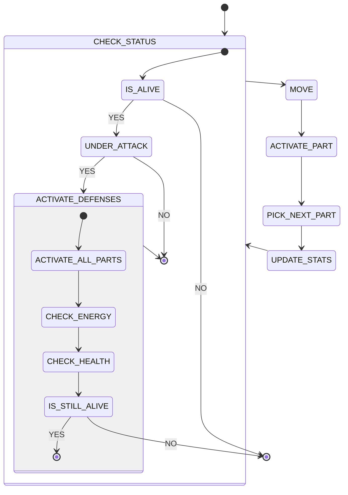
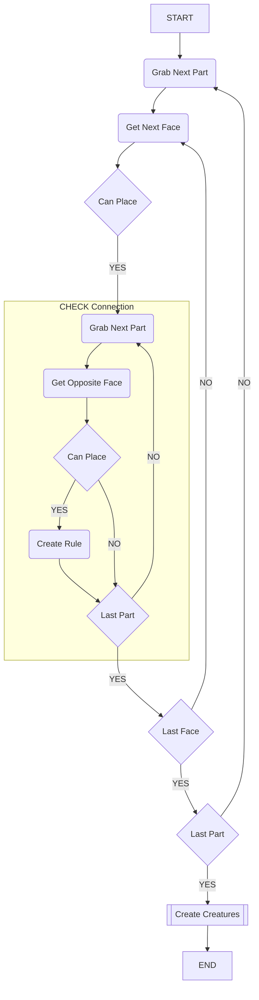

## Inital Creature Actions List

This was the original concept of the creatues "daily" activities this has since been simplfied due to changes in the parts class.

## Inital Wave Fuinction Collapse Algorithm

This was the original concept for the Wave Funciton Collapse Algoirthm. This does not follow the actual model for a wave function collapse algoirhtm leading to design issues.

This would be a good design for a random body generator. A key funciton of Wave Funciton collapse is taking advantage of the concept of entropy.

