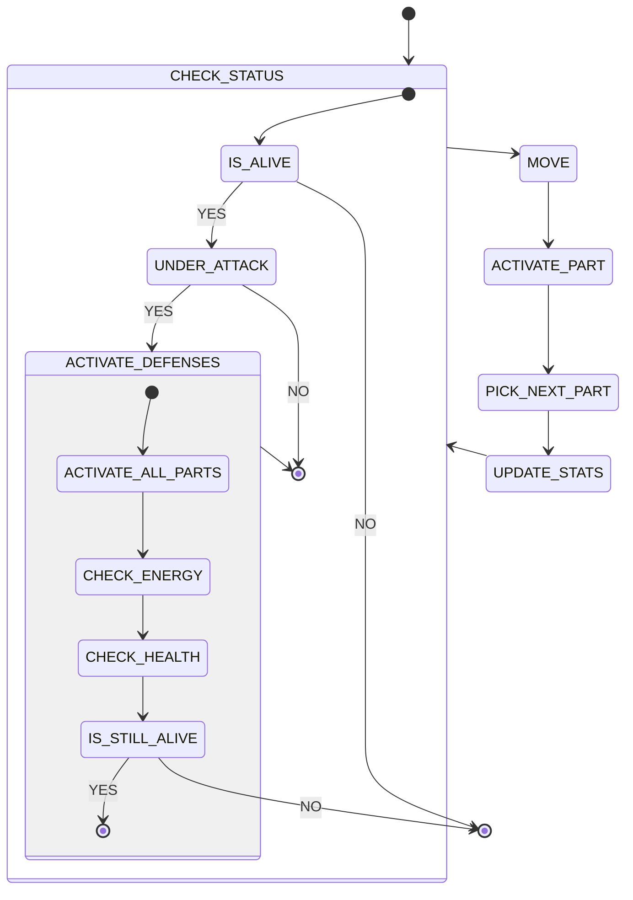
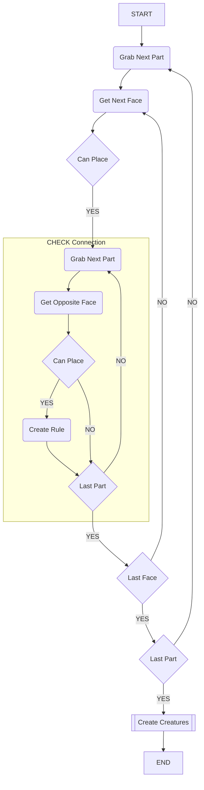

# wavy-life-sim

This is a school project the goal is to make a LIfe Simulation that uses Wave Funciton Collapse.

Check out our [discord](https://discord.gg/vJMGvk5KaZ)!

To see our project backlog [click here](https://github.com/users/Negative-light/projects/1)

## Inital Concept

Use a Wave Function collapse algorithm to generate the body of creatures that survive in a artifical life simulation.

This is a novel use of the Wave Function Collapse Algorithm which is typically used to generate unique structures, puzzels and

## Project Requirments

- Creatures shall have a body generated using Wave Function Collapse
- A genetic algorithm shall be used for the weights on rules

## Inital Design

### Creature Lifetime

### Inital Classes

### Wave Function Collapse Alogrithm

## State of Completion

- [x] Creature Parts
- [ ] Effects System
- [ ] Wave Function Collapse Algorithm
- [ ] Creature Gentic Algorithm
- [ ] Creature Brain
