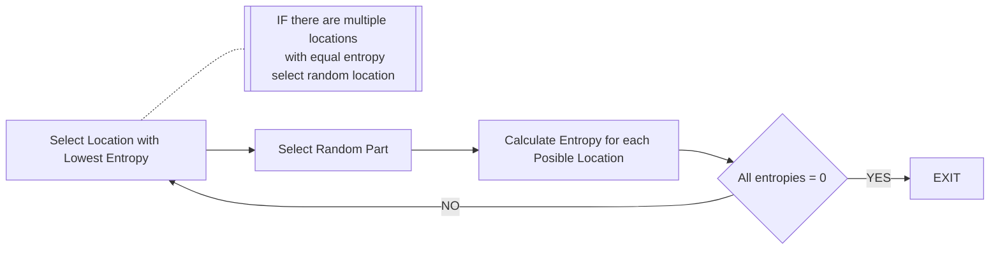
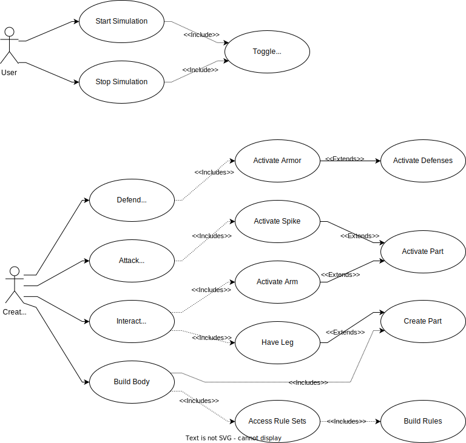

# wavy-life-sim

This is a school project the goal is to make a LIfe Simulation that uses Wave Funciton Collapse.

Check out our [discord](https://discord.gg/vJMGvk5KaZ)!

To see our project backlog [click here](https://github.com/users/Negative-light/projects/1)

## Inital Concept

Use a Wave Function collapse algorithm to generate the body of creatures that survive in a artifical life simulation.

This is a novel use of the Wave Function Collapse Algorithm which is typically used to generate unique structures, puzzels and

## Project Requirments

- Creatures shall have a body generated using Wave Function Collapse
- A genetic algorithm shall be used for the weights on rules
- Creature Parts shall be rotatable.

## Inital Design

### Creature Phases

During the simulation the creature will go through a few stages. If we treated a set of actions as a day this is how craetures would act.

When a creature "wakes up" it will check if it is alive, then it will attempt to move. This will result in it both consuming food particles it runs into and concsuming food based on the distance travled and the nubmer of parts the creature consists of. After it has moved, the creature will then activate any effects of its parts, these could include healing the creature or attacking other creatures. If a creature has been attaked it will then activate other defensive measure, these could include any activity that has occured during the Activate Parts stage of the creatures day. After this it will sleep and start over again.


### Inital Classes

The following classes would be needed based on our inital analysis. Please see the [State of Completion Section](#state-of-completion) and [project](https://github.com/users/Negative-light/projects/1) for more information.


### Wave Function Collapse Alogrithm

Wave Function Collapse is similar to filling a empty Sodoku board. Start by picking a cell and filling it with a random value. This changes a Block, Row and Column to have one less possible values. In other terms the cells in the effect Block, Row and Column have lower **entropy**. In Wave Function Collapse you pick on of these lower entropy cells and set a new value. This cycle repeats until the last cell on the board is filled.

Commonly Wave Function collpase will use a image as a baseline to determin what pieces can connect. Then rules are dynamically generated based on a window size (typeically 3x3) of a a pixelart image. This dynamic rule genration is useful for us, but it doesn't neccesarily work this way since our parts do not rely on a visual model.

Because the parts of the creatures should be rotatable we need to be able to generate a dynamic set of rules based on

1. The Inital Parts connections
2. The Secondary Parts connections

This will give us a allowed and denied list of locations.

For the sake of simplification the design decision was made to have all parts exist on a grid and for the time being the parts will not have any movment outside of the creatures movement.

So the Wave Funciton Collapse can be generated in two stages. Creating a matrix of Possible connections bewtween a set of parts. Because we want the nubmer of parts to be rather dynamic it would be best that this is 100% algorithmic. Because parts can be rotated this creates more complex sets of rules.

To understand how the Rule Set generation works we must first generate a Rule. Consider part A which can connect on all four faces, and part B which can only connect on its North face when the part is facing North. This ruleset will be for A connecting to B.

The matrix below where the rows represent the faces of part A and the columns the faces of part B.

```math
\begin{Bmatrix}
 & NORTH & EAST & SOUTH & WEST\\
NORTH & 1 & 0 & 0 & 0\\
EAST  & 1 & 0 & 0 & 0\\
SOUTH & 1 & 0 & 0 & 0\\
WEST  & 1 & 0 & 0 & 0\\

\end{Bmatrix}
```

Now lets use this for part B connecting to part A. Lets start by assuming that Part B is facing North.

```math
\begin{Bmatrix}
 & NORTH & EAST & SOUTH & WEST\\
NORTH & 1 & 1 & 1 & 1\\
EAST  & 0 & 0 & 0 & 0\\
SOUTH & 0 & 0 & 0 & 0\\
WEST  & 0 & 0 & 0 & 0\\

\end{Bmatrix}
```

Now lets rotate Part B to be facing EAST meaning that this instance of Part B can only connect on its east face.

```math
\begin{Bmatrix}
 & NORTH & EAST & SOUTH & WEST\\
NORTH  & 0 & 0 & 0 & 0\\
EAST & 1 & 1 & 1 & 1\\
SOUTH & 0 & 0 & 0 & 0\\
WEST  & 0 & 0 & 0 & 0\\

\end{Bmatrix}
```

You may notice that Part B's matrix only shifted based on the direction of the North Face. This means that we can apply a shift value to the search indicies of the matrix reducing the total number of rules needed to be generated.

### Entropy Calculation

Now that we understand how to create a matrix of possible connections we must now calcualte the entorpy. To do this we must also apply a probabity to each part connection. This means that we need to assign each connection a weight. Once this is assigned we can calcualate the entorpy of each possible location by using the entorpy calculation,

```math
\sum_{i=0}^n p_i*log_2(1/p_i)
```

Where $n is the number of possible occureces and $p_i is the probabilty of a unquie case. This results in a unique value for the entoryp in bits of inormation. For more information on this calculaiton and the concept of entropy please refer to [this article](https://tdhopper.com/blog/entropy-of-a-discrete-probability-distribution).

Based on this calcuation for each none 0 value for entropy we can pick the lowest and using the weighted probabilty select the next part.

### Workflow

This gives us a general workflow for doing the Wave Function Collapse Algorithm.



## Use Cases

Below are the usecases for the USER and for Creatures. WE shoose to treat the Creature as a Actor due to the complex nature of how the simulation will work in the end. Ultimatly the Creature will "Think" on its own hopefully.



## State of Completion

- [x] Creature Parts
- [ ] Effects System
- [ ] Wave Function Collapse Algorithm
- [ ] Creature Gentic Algorithm
- [ ] Creature Brain

### Project Needs

Multithreading of part activation becuase there will be upwards of 100 parts for a creature. Since all of these will have a a number of actions.

Check on solutions to migration to Godot 4.0. This new version of Godot brings massive change and massive imporvments. Since this is a opensource game engine there may be existing tools. Exploration should be done to find these.
